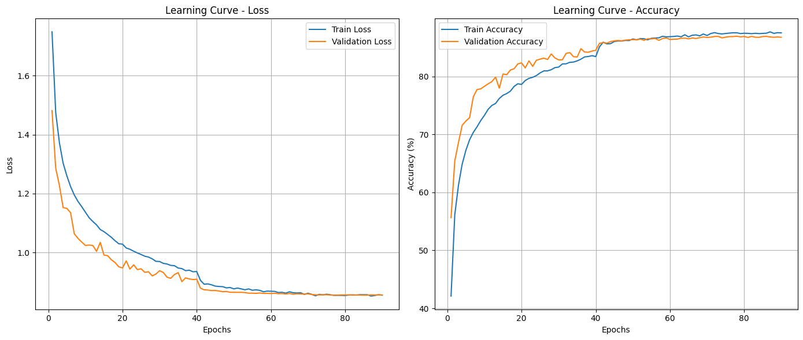
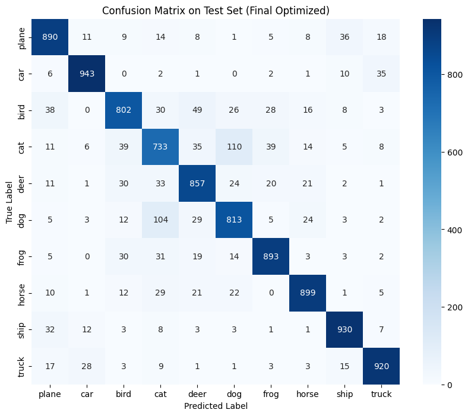

# 🎬 CNN Image Classification – Major Project

## 📌 Overview

This project builds a **Convolutional Neural Network (CNN)** from scratch to classify images in the **CIFAR-10** dataset. Focuses on enhancing performance, improving generalization, and interpreting the training process through essential techniques such as **data augmentation**, **regularization**, and **learning rate scheduling**.

---

## 🎯 Objectives

- Classify images into 10 CIFAR-10 categories with high accuracy.
- Visualize model performance and training behavior.

---

## ⚙️ Tools & Techniques

- **Language:** Python  
- **Framework:** PyTorch  
- **Source Code:** `CNN_Image_Classification.ipynb`  

### 🧠 Optimization Strategies

- **Data Augmentation:** `RandomCrop`, `HorizontalFlip`, `RandomErasing`
- **Regularization:** Dropout (0.5), Weight Decay, Label Smoothing (0.1)
- **Optimizer:** AdamW
- **Learning Rate Scheduler:** ReduceLROnPlateau
- **Early Stopping:** Patience = 5

---

## 📈 Results

- **Test Accuracy:** 86.80%
- **Best Validation Loss:** 0.8549 (at epoch 85)

### 🔍 Highlights

- Hierarchical feature extraction using a CNN architecture with progressively increasing channel depth (from 3 to 128) and decreasing spatial resolution, capturing both low-level and high-level visual patterns.

- Robust generalization enabled by extensive data augmentation and regularization techniques, helping the model avoid overfitting.

- Label smoothing contributed to more calibrated predictions by reducing overconfidence in the model’s outputs.

- Class confusion between cats and dogs remains a challenge, highlighting typical CNN limitations when dealing with low-resolution and visually similar categories.

---

## 📊 Visualizations

<div style="text-align: center; margin: 50px 0;" >
  <h6>Training & Validation Accuracy/Loss Curves</h6>
  
</div>

<div style="text-align: center; margin: 50px 0;">
  <h6>Confusion Matrix</h6>
  
</div>

---

## 🚀 How to Run

#### Option 1: Run on Google Colab (Recommended)
1. Visit: [Google Colab](https://colab.research.google.com)
2. Upload `CNN_Image_Classification.ipynb`
3. Click `Runtime > Run all`

#### Option 2: Run Locally
```bash
pip install notebook
jupyter notebook
```
- Open `CNN_Image_Classification.ipynb` in the browser.
- Press `Shift + Enter` to run each cell.

---

## 👤 Author

- **Vũ Thị Thu Duyên**  
- 📧 Email: vuthuduyen.2010@gmail.com 
- 🌐 GitHub: [github.com/ThuDuyenn](https://github.com/ThuDuyenn)
  
<br><br>
> 📝 *This project is a assignment for the Python course. All models and results are achieved through thorough experimentation and careful optimization.*